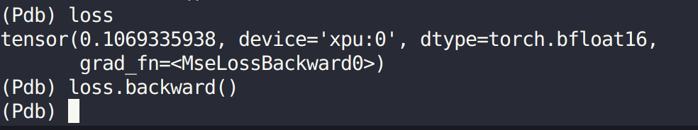
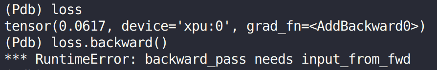
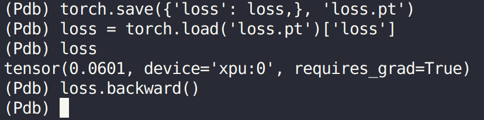
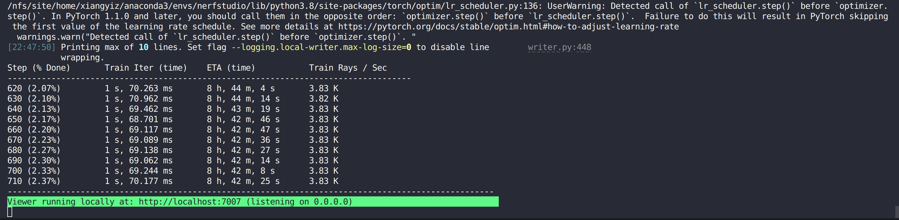

# RuntimeError: backward_pass needs input_from_fwd

## Place 
"tiny-dpcpp-nn/dpcpp_bindings/tiny_dpcpp_nn/modules.py", line 126
'''
input_grad, grad = ctx.native_tcnn_module.bwd_no_encoding_grad(doutput, pack_weights, True)
'''

## Command
'''
ns-train nerfacto --data data/nerfstudio/desolation --machine.device-type xpu
'''

## Solution
1. Saved ctx and doutput into pickle file and load again, it works. 
But the saved data did not have gradient infomation. This way actually cut the backward path, even it can run the pipeline but did not work actually. This is why we cannot reproduce the issue in a small and clean case. It only can run on the original code and reproduce again.

2.  Other validation in tiny-dpcpp-nn/python/tests/test_train_grid.py
- test tinydpcppnn loss backward function

- test nerfstudio loss backward function

- Save nerfstudio loss to tiny-dpcpp-nn/python/tests/test_train_grid.py

- Save nerfstudio loss value then load and backward, it works. But such way lost the gradient from the graph.

